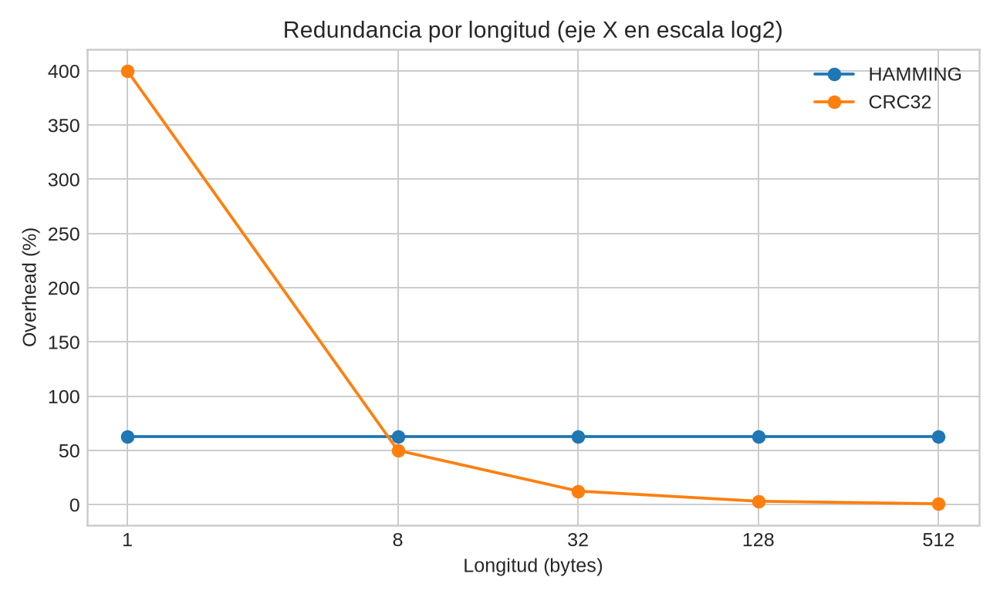
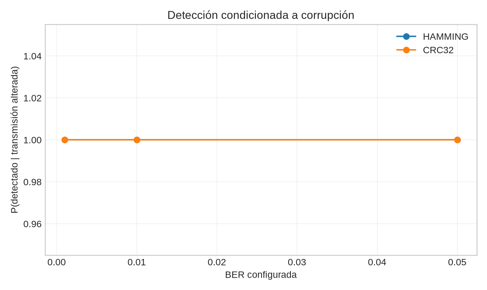
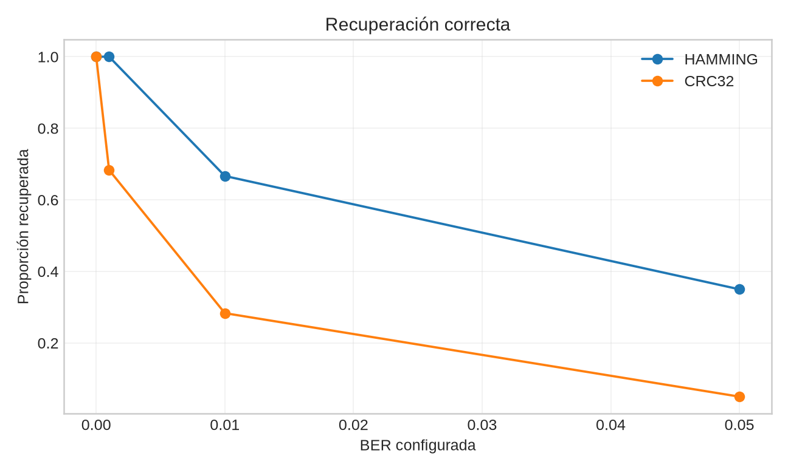
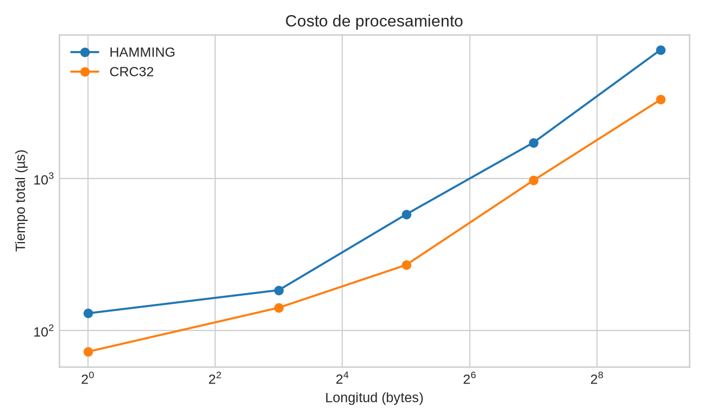
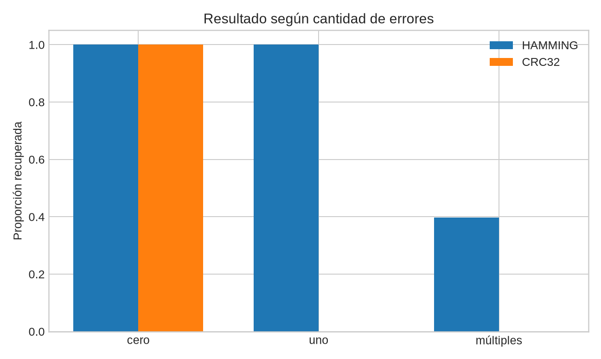

# Portada {.unnumbered}

**Universidad del Valle de Guatemala**  
**CC3067 Redes**

**Título:** Laboratorio 2 - Esquemas de detección y corrección de errores  
**Autor:** Luis Fernando Mendoza Alvarez  
**Carné:** 19644  
**Repositorio:** <https://github.com/lfmendoza/error-control-lab>

\newpage

# Descripción de la práctica

Se construyó una comunicación por capas sobre un canal binario no confiable. Un
emisor C++23 convierte texto UTF-8 o bits, añade redundancia, aplica ruido y
entrega una trama JSONL. Un receptor Python 3.13 valida la estructura y detecta,
corrige o rechaza el mensaje. El flujo funciona por copia/archivo y por TCP local.

# Objetivos

- Aplicar servicios de aplicación, presentación, enlace y transporte.
- Implementar Hamming SECDED para corrección y CRC-32 para detección.
- Medir redundancia, detección, recuperación y costo ante ruido reproducible.
- Delimitar empírica y teóricamente las garantías de ambos esquemas.

# Arquitectura por capas

Aplicación solicita o muestra; presentación convierte UTF-8/bytes/bits; enlace
calcula integridad; el canal altera cualquier bit; transporte mueve una línea
delimitada. La lógica matemática es pura y desconoce CLI y sockets. TCP usa
localhost por defecto, timeout de cinco segundos, envío completo y cierre de
escritura ordenado. El detalle ejecutable está en `docs/architecture.md`.

# Diseño del formato de trama

La versión 1 exige algoritmo, codificación, longitud original y datos codificados.
Para Hamming incluye tamaño de bloque; los metadatos registran modo, BER, semilla,
posiciones alteradas y tiempo. La longitud original permite quitar padding. El
receptor restringe tipos, alfabetos, tamaños y coherencia; no interpreta código.

# Fundamento de Hamming SECDED

Para cada bloque de (m) bits se obtiene el menor (r) con
(2^r \ge m+r+1). Las posiciones (1,2,4,8,\ldots) contienen paridad par y las
restantes datos. El XOR de comprobaciones forma el síndrome. Una paridad global
extiende Hamming a SECDED: corrige un error, identifica un error solo en la paridad
global y detecta dos sin corregirlos [@hamming1950]. Bloques mayores se procesan
independientemente y el último se rellena determinísticamente.

# Fundamento de CRC-32

CRC modela la trama como polinomio sobre GF(2) y transmite el residuo de división
por un generador [@williams1993]. Se implementó CRC-32/ISO-HDLC con polinomio
normal `0x04C11DB7`, reflejado `0xEDB88320`, inicio y XOR final `0xFFFFFFFF`, y
reflexión de entrada/salida. `123456789` da `0xCBF43926`. CRC solo detecta: ante
discordancia no sabe qué bit reparar y descarta.

# Metodología experimental

Se probaron ambos algoritmos con longitudes 1, 8, 32, 128 y 512 bytes; BER 0,
0.001, 0.01 y 0.05; y 12 semillas derivadas de 19644. Cada fila procede de una
ejecución del emisor y una decodificación real. Se registraron flips, overhead,
detección, corrección, falso negativo, recuperación y tiempos monotónicos. Esta
matriz es moderada para que `just experiments` sea repetible.

# Escenarios de prueba

La batería automatizada evaluó 18 combinaciones reproducibles: tres mensajes de
distinta longitud, dos algoritmos y cero, uno o múltiples flips. Las posiciones
se generaron con semillas fijas; los registros completos se conservan en
`report/evidence/required-cases.log`. También se cubrieron bits sin múltiplo de
ocho, UTF-8, JSON truncado, metadata incoherente, entrada inválida y TCP local.

# Resultados



En la tabla, **Total** es el número de transmisiones ejecutadas para el algoritmo
y **Alteradas** es el subconjunto con al menos un bit flip real. La tasa de
**Detección** tiene como numerador las transmisiones alteradas marcadas por el
receptor y como denominador todas las transmisiones alteradas; por tanto, no
incluye transmisiones intactas. **Corr. global** usa como numerador las
transmisiones recuperadas exactamente y como denominador el total. **Corr.
alteradas** usa el mismo numerador restringido a alteradas, y **FN alteradas**
cuenta alteraciones no detectadas divididas entre alteraciones. Los tiempos son
promedios sobre todas las transmisiones del algoritmo: nanosegundos medidos en el
emisor para codificación y en el receptor para decodificación.

{width=85%}

{width=85%}

{width=85%}

{width=85%}

{width=85%}

## Evidencia visual de ejecuciones reales

Las siguientes figuras se generaron a partir de tramas emitidas y decodificadas
durante la ejecución experimental; cada una conserva los parámetros usados y el
resultado observado.

{width=90% fig-pos="H"}

{width=90% fig-pos="H"}

{width=90% fig-pos="H"}

\newpage

{width=90% fig-pos="H"}

La gráfica de overhead conserva las longitudes reales de 1, 8, 32, 128 y 512
bytes; el eje X está en escala log2 y muestra esas longitudes como etiquetas. CRC
agrega 32 bits fijos: por eso representa 400% para un byte y el porcentaje cae al
aumentar el mensaje. Hamming SECDED agrega cuatro bits de paridad más un bit
global por cada bloque de 8 datos, manteniendo aproximadamente 62.5% de overhead.

# Discusión

Hamming funciona mejor cuando importa recuperar inmediatamente y el ruido suele
afectar un solo bit por bloque: paga 62.5% de redundancia con bloques de ocho,
pero evita retransmitir. CRC añade solo 32 bits por trama; su porcentaje cae al
crecer el mensaje y resulta preferible cuando existe retransmisión y se busca
detectar alteraciones con poco overhead.

“Tolerar” requiere distinguir objetivos. CRC conserva una fuerte capacidad de
detección a tasas donde SECDED ya no puede recuperar; Hamming tolera más en el
sentido de entregar el mensaje tras errores aislados. A BER creciente aparecen
varios flips en un mismo bloque: SECDED puede rechazar pares y malcorregir patrones
impares mayores. Por ello detección no equivale a corrección, y aceptación no
equivale necesariamente a recuperación correcta. Un falso negativo es una
alteración real aceptada con datos distintos.

La implementación de ambos algoritmos es lineal en los bits. Hamming realiza
varias comprobaciones por bloque y tiene overhead proporcional; CRC hace ocho
iteraciones por byte y overhead fijo. Los tiempos medidos incluyen el núcleo de
codificación/decodificación, no el arranque de procesos ni transporte.

# Limitaciones y casos que superan el algoritmo

La búsqueda exhaustiva reproducible en `report/evidence/limitations.json` altera
combinaciones en una trama corta. Para SECDED encuentra tres flips aceptados tras
una “corrección” equivocada. Es una **malcorrección** (el síndrome sí indicó un
error, pero el daño no corregible fue clasificado como corregible), no un falso
negativo estricto. Confirma que la garantía se limita a SEC-DED, no a tres errores.

Para CRC se enumeran patrones de uno a cuatro flips y se informa exactamente
cuántos se ensayaron. Si el archivo registra un patrón no detectado, constituye
un múltiplo efectivo del generador; si registra `null`, el resultado significa
solo que el conjunto finito elegido no encontró uno, no que CRC sea infalible.
Algebraicamente, todo patrón de error divisible por el polinomio generador deja
el mismo residuo, limitación inherente de cualquier CRC [@williams1993].

# Conclusiones

1. La interoperabilidad exige especificar orden de bits, padding, longitud y
   parámetros CRC; compartir solo el nombre del algoritmo es insuficiente.
2. SECDED recupera con exactitud un error por bloque y rechaza dos, pero no debe
   usarse como garantía frente a tres o más.
3. CRC-32 ofrece overhead fijo y detección robusta, pero necesita descarte o
   retransmisión porque no localiza ni corrige el daño.
4. Las métricas separadas evitan afirmar “éxito” cuando hubo detección sin
   recuperación o aceptación incorrecta.

# Referencias

::: {#refs}
:::
